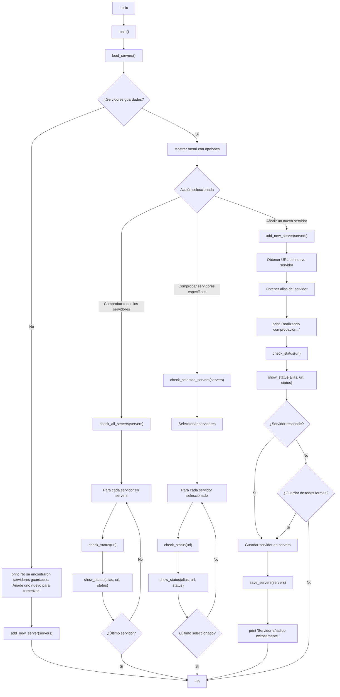

# Server Status Checker

Este proyecto es un script en Python que permite gestionar y verificar el estado de servidores. Los servidores pueden ser añadidos, almacenados y verificados en cualquier momento, guardando sus URLs y alias en un archivo JSON.

## Funcionalidades

-   **Carga y guarda de servidores**: Utiliza un archivo `servers.json` para guardar las URLs de los servidores junto con sus alias.
-   **Verificación de estado**: Permite verificar el estado de los servidores guardados, comprobando si responden o no.
-   **Interfaz de usuario**: Emplea `questionary` para mostrar opciones de selección y la biblioteca `rich` para mostrar el resultado en la consola de forma estilizada.

## Requisitos

-   Python 3.10 o superior
-   Paquetes adicionales: `requests`, `questionary`, `rich`

Puedes instalar los paquetes requeridos usando el siguiente comando:

```bash
pip install -r requirements.txt
```

## Uso

Para ejecutar el script, utiliza:

```bash
python health_check.py
```

### Opciones principales

1. **Comprobar todos los servidores**: Verifica el estado de todos los servidores guardados en el archivo `servers.json`.
2. **Comprobar servidores específicos**: Permite seleccionar servidores específicos para verificar su estado.
3. **Añadir un nuevo servidor**: Añade un nuevo servidor al archivo `servers.json` y realiza una verificación inicial de su estado.

### Diagrama del flujo de trabajo



### Archivos

-   **`health_check.py`**: Contiene el código principal del script.
-   **`servers.json`**: Archivo JSON que almacena las URLs y alias de los servidores.

## Ejemplo

1. Al ejecutar el script, te preguntará qué acción deseas realizar.
2. Selecciona una acción (comprobar servidores, añadir un nuevo servidor, etc.).
3. Si añades un nuevo servidor, el script intentará verificar si responde y, si no, te preguntará si deseas guardarlo de todas formas.
4. Los resultados de las comprobaciones se mostrarán en la consola.

### Ejemplo de `servers.json`

```json
{
    "Servidor1": "https://example.com",
    "Servidor2": "https://example.org"
}
```

## Contribuir

1. Realiza un fork del proyecto.
2. Crea una rama para tu feature (`git checkout -b feature/AmazingFeature`).
3. Realiza commit de tus cambios (`git commit -m 'Add some AmazingFeature'`).
4. Haz push a la rama (`git push origin feature/AmazingFeature`).
5. Abre una Pull Request.

## Licencia

Este proyecto está licenciado bajo la Licencia MIT.
