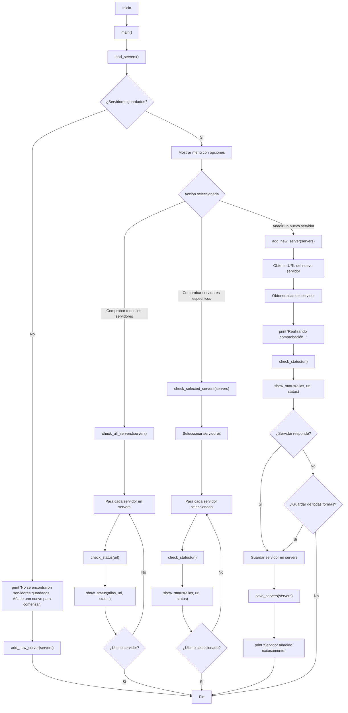

```mermaid
    flowchart TD
Start[Inicio] --> Main["main()"]
Main --> LoadServers["load_servers()"]
LoadServers --> HasServers{¿Servidores guardados?}

    HasServers -->|No| NoServers["print 'No se encontraron servidores guardados. Añade uno nuevo para comenzar.'"]
    NoServers --> AddNewServer["add_new_server(servers)"]
    AddNewServer --> End[Fin]

    HasServers -->|Sí| ShowMenu["Mostrar menú con opciones"]
    ShowMenu --> Action{Acción seleccionada}

    Action -->|Comprobar todos los servidores| CheckAll["check_all_servers(servers)"]
    Action -->|Comprobar servidores específicos| CheckSelected["check_selected_servers(servers)"]
    Action -->|Añadir un nuevo servidor| AddServer["add_new_server(servers)"]

    %% Flujo para 'Comprobar todos los servidores'
    CheckAll --> ForEachServer["Para cada servidor en servers"]
    ForEachServer --> CheckStatus["check_status(url)"]
    CheckStatus --> ShowStatus["show_status(alias, url, status)"]
    ShowStatus --> IsLastServer{¿Último servidor?}
    IsLastServer -->|No| ForEachServer
    IsLastServer -->|Sí| End

    %% Flujo para 'Comprobar servidores específicos'
    CheckSelected --> SelectServers["Seleccionar servidores"]
    SelectServers --> ForEachSelected["Para cada servidor seleccionado"]
    ForEachSelected --> CheckStatusSelected["check_status(url)"]
    CheckStatusSelected --> ShowStatusSelected["show_status(alias, url, status)"]
    ShowStatusSelected --> IsLastSelected{¿Último seleccionado?}
    IsLastSelected -->|No| ForEachSelected
    IsLastSelected -->|Sí| End

    %% Flujo para 'Añadir un nuevo servidor'
    AddServer --> GetURL["Obtener URL del nuevo servidor"]
    GetURL --> GetAlias["Obtener alias del servidor"]
    GetAlias --> PrintChecking["print 'Realizando comprobación...'"]
    PrintChecking --> CheckStatusNew["check_status(url)"]
    CheckStatusNew --> ShowStatusNew["show_status(alias, url, status)"]

    ShowStatusNew --> IsUp{¿Servidor responde?}
    IsUp -->|Sí| SaveServer["Guardar servidor en servers"]
    SaveServer --> SaveServersFile["save_servers(servers)"]
    SaveServersFile --> PrintSuccess["print 'Servidor añadido exitosamente.'"]
    PrintSuccess --> End
    IsUp -->|No| AskSave{¿Guardar de todas formas?}
    AskSave -->|Sí| SaveServer
    AskSave -->|No| End
```
